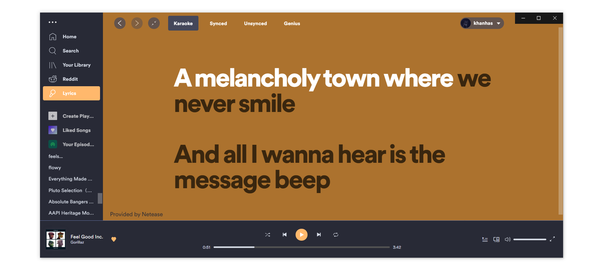
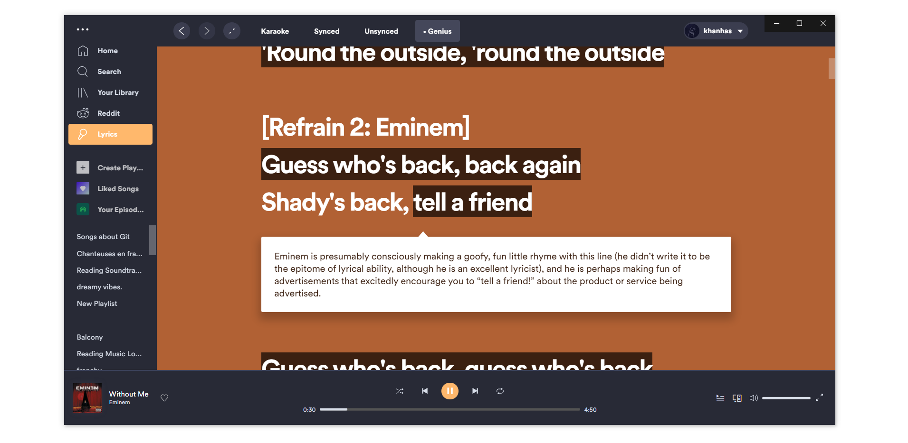
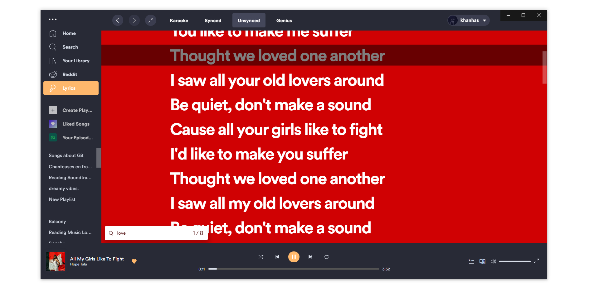
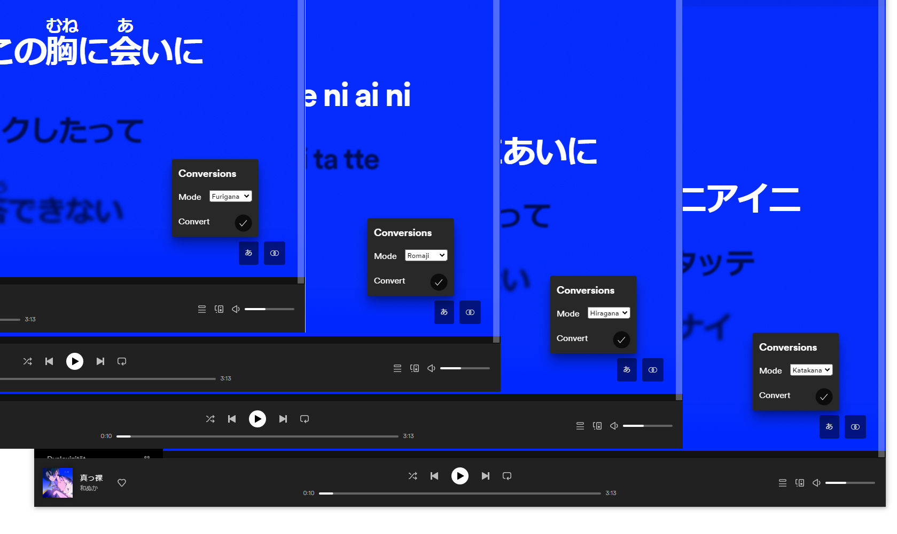

# Spicetify Custom App

### Lyrics Plus

Show current track lyrics. Current lyrics providers:

- Internal Spotify lyrics service.
- Netease: From Chinese developers and users. Provides karaoke and synced lyrics.
- Musixmatch: A company from Italy. Provided synced lyrics.
- Genius: Provide unsynced lyrics but with description/insight from artists themselve.





Different lyrics modes: Karaoke, Synced, Unsynced and Genius. At the moment, only Netease provides karaoke-able lyrics. Mode is automatically falled back, from Karaoke, Synced, Unsynced to Genius when lyrics are not available in that mode.

Right click or Double click at any mode tab to "lock in", so lyric mode won't auto switch. It should show a dot next to mode name when mode is locked. Right click or double click again to unlock


Lyrics in Unsynced and Genius modes can be search and jump to. Hit Ctrl + Shift + F to open search box at bottom left of screen. Hit Enter/Shift+Enter to loop over results.



Choose between different option of displaying Japanese lyrics. (Furigana, Romaji, Hiragana, Katakana)



Customise colors, change providers' priorities in config menu. Config menu locates in Profile Menu (top right button with your user name).

To install, run:

```bash
spicetify config custom_apps lyrics-plus
spicetify apply
```

### Credits

- A few parts of app code are taken from Spotify official app, including SyncedLyricsPage, CSS animation and TabBar. Please do not distribute these code else where out of Spotify/Spicetify context.
- Netease synced lyrics parser is adapted from [mantou132/Spotify-Lyrics](https://github.com/mantou132/Spotify-Lyrics). Give it a Star if you like this app.
- The algorithm for converting Japanese lyrics is based on [Hexenq's Kuroshiro](https://github.com/hexenq/kuroshiro).
- The algorithm for converting Chinese lyrics is based on [BYVoid's OpenCC](https://github.com/BYVoid/OpenCC) via [nk2028's opencc-js](https://github.com/nk2028/opencc-js).
- The algorithm for converting Korean lyrics is based on [fujaru's aromanize-js](https://github.com/fujaru/aromanize-js)
- The algorithm for detecting Simplified Chinese is adapted from [nickdrewe's traditional-or-simplified](https://github.com/nickdrewe/traditional-or-simplified).
