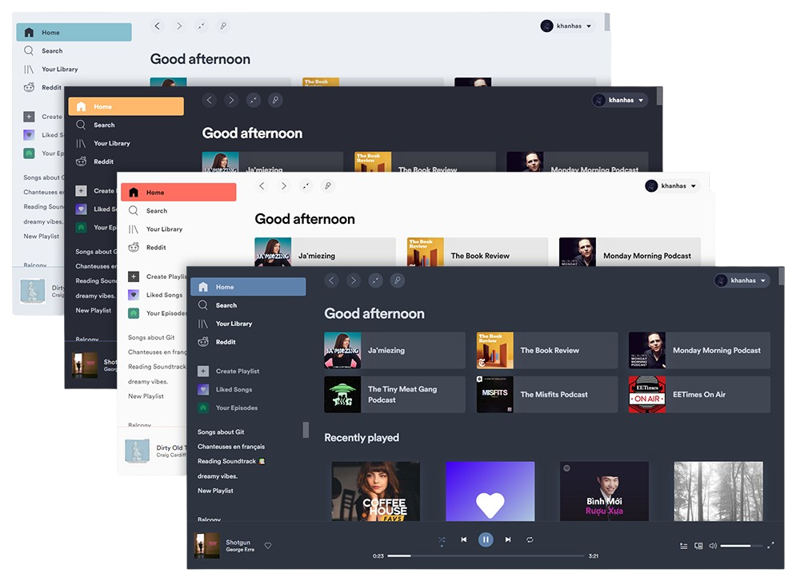

<h3 align="center"><a href="https://spicetify.app/"></a></h3>
<p align="center">
  <a href="https://goreportcard.com/report/github.com/spicetify/cli"></a>
  <a href="https://github.com/spicetify/cli/releases/latest"></a>
  <a href="https://github.com/spicetify/cli/releases"></a>
  <a href="https://discord.gg/VnevqPp2Rr"></a>
</p>

---

Command-line tool to customize the official Spotify client.
Supports Windows, MacOS and Linux.



### Features

- Change colors across the User Interface
- Inject CSS for advanced customization
- Inject Extensions to extend functionalities, manipulate UI and control player
- Inject Custom Apps
- Make yourself in control of the Spotify client

### Links

- [Installation](https://spicetify.app/docs/getting-started)
- [Basic Usage](https://spicetify.app/docs/getting-started#basic-usage)

---

### v3: the Rust CLI (in progress, `rust/`)

The v3 CLI is being rebuilt in Rust. v3 is a different model rather than a
faster v2, so upgrading is a reinstall. What it changes:

- **Customise Spotify without leaving Spotify.** Extensions, custom apps and
  themes all become one thing (modules), browsable and installable from a store
  inside the client. Most take effect immediately; the few that need a restart
  say so. The CLI is still there (`spicetify pkg`) if you prefer it.
- **A Spotify update no longer means a broken client.** v3 repairs itself after
  Spotify updates in the background, and a new Spotify build no longer waits on
  a new Spicetify release to be supported. When something genuinely is not
  supported yet, the client says which part is degraded instead of silently
  looking wrong.
- **An update that goes wrong is recoverable.** Installed versions are kept
  side by side, so going back is `spicetify pkg enable <module>@<old version>`
  rather than hunting down an old download.

#### Shell completions

The v3 CLI can complete commands and options in Bash, Zsh, Fish, PowerShell,
and Elvish.

<!-- prettier-ignore -->
> [!NOTE]
> Shell completion is experimental. Generate the registration code when your
> shell starts so it stays compatible after Spicetify updates.

Add the command for your shell to its startup file:

- Bash (`~/.bashrc`): `source <(COMPLETE=bash spicetify)`
- Zsh (`~/.zshrc`): `source <(COMPLETE=zsh spicetify)`
- Fish (`~/.config/fish/completions/spicetify.fish`):
  `COMPLETE=fish spicetify | source`
- PowerShell (`$PROFILE`):

  ```powershell
  $env:COMPLETE = "powershell"; spicetify | Out-String | Invoke-Expression; Remove-Item Env:\COMPLETE
  ```

- Elvish (`~/.elvish/rc.elv`):
  `eval (E:COMPLETE=elvish spicetify | slurp)`

---

### Code Signing Policy

Free code signing provided by [SignPath.io](https://signpath.io), certificate by [SignPath Foundation](https://signpath.org/).
